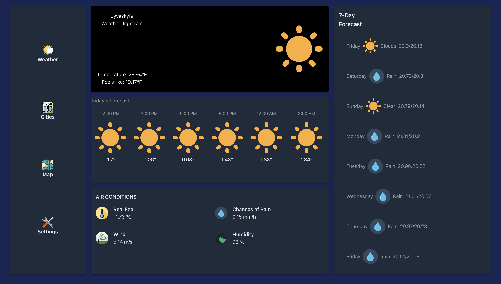

# Weather-App-React

A weather application to learn React.


## Features

- Navigation bar
- Current weather
- Air Conditions
- Weekly forecast
- Hourly forecast

## Running the project
- Clone repository
- Install dependencies 
- Run project

```sh
cd Weather-App-React
npm i
npm start
```

## Technologies Used
List the technologies, libraries, and frameworks you used in project. 
- React
- React Router for navigation
- Axios for API requests
- Tailwind CSS for styling components

## Presentation Link 
https://shorturl.at/lovy4


## Screenshot
